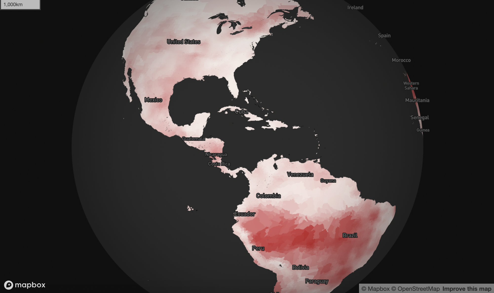
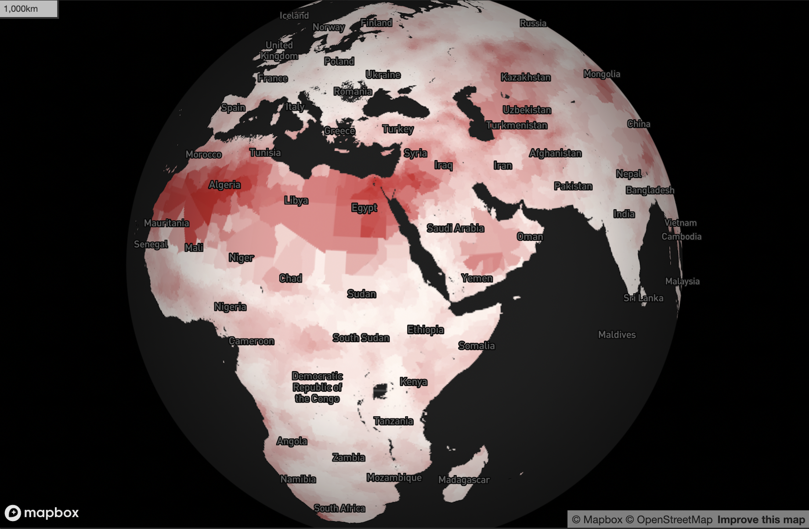

# Displaying burned raster data on a 3D Mapbox globe
This repository is meant to show how you can display raster data, burned onto vector data, on a Mapbox map. There are two Jupyter Notebooks that process our various data sources in Python, after which we can display the data on a 3D globe in Mapbox hosted in a Shiny app.

## Python environment
To recreate the conda environment we use in this repository, please run:
```
conda env create -f environment.yml
```
And to activate the environment:
```
conda activate shiny_geo
```

## Merge the shapefile data
I want to use [GADM](https://gadm.org/download_world.html) boundary files to be able to create a set of global shapefiles. I downloaded the level 1 and 2 boundary files separately instead of downloading the full dataset, which is quite large. In [0_global_county_merge_shapefiles.ipynb](./notebooks/_global_county_merge_shapefiles), I show how to merge level 1 and 2 subdivisions (because some countries only have states, not further subdivisions like counties). I will then "burn" raster data onto this new dataset so that it can be quickly loaded onto a Mapbox map.

## Burn the raster data onto vectors
In the Jupyter Notebook, [1_calculate_zonal_statistics.ipynb](./notebooks/1_calculate_zonal_statistics.ipynb), I make use of the `make_geocube()` function within the [geocube](https://corteva.github.io/geocube/html/index.html) package to burn a raster of projected future drought onto our newly merged global shapefiles representing either counties or states within different countries. Plotly is too slow for how many shapefiles I want to render, especially for the 3D view. I then export that data so it can be more quickly rendered using a Mapbox map within a Shiny app.

After running this Notebook, you should be able to go from an input raster like this:


To an output vector shapefile like this:


## Display on a Mapbox globe
I created a small Shiny app that let's me code a user interface and run a server in Python. From within the `shiny_app/` folder, to start a local server and see the app, please run:
```python
shiny run --reload map_app.py
```

You should see a map that looks like this:




You might notice that the `server` function within `map_app.py` is empty. This is because `load_map.js` does the heavy lifting for us; it is easier to write and customize a Mapbox map in JavaScript and call it from the user interface than it is to write something in Python that is as performance and call it through a more traditional `@render` function.
