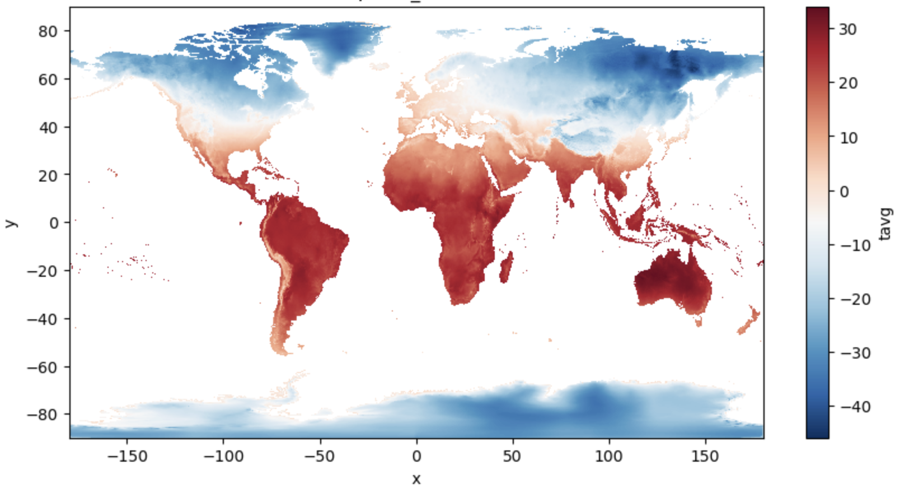

# Displaying burned raster data on a 3D Mapbox globe
This repository is meant to show how you can display raster data, burned onto vector data, on a Mapbox map. This is a very niche solution to the problem of not wanting to:
- develop an interactive web map in JavaScript
- not host `.mbtiles`
- display data without global extent
- use a 3D globe projection

If that were not the case, then you could work with CarbonPlan's [`maps`](https://github.com/carbonplan/maps/tree/main) package, which is much quicker, but requires that:
- you program in React
- save your data in `protobuf` and `zarr` (though you can also still work with `GeoJSON` files)
- your data be global in extent
- you use the Web Mercator projection (no others are available right now)

With that being said, this repository is simply a tutorial for how this *could* be done. It is, unfortunately, especially slow for high-resolution, global data. 

## Python environment
To recreate the conda environment we use in this repository, please run:
```
conda env create -f environment.yml
```
And to activate the environment:
```
conda activate raster_burn
```

## Creating vector layers
There are two different data pre-processing approaches shown in this repository. The first is for burning raster data onto polygons (as in the case with the [GADM](https://gadm.org/download_world.html) data) and the second is for trying to burn the data onto a manually-created grid at the data's native resolution.

For the GADM approach specifically, I downloaded the level 1 and 2 boundary files separately instead of downloading the full dataset, which is quite large. I then had to merge level 1 and 2 subdivisions (because some countries only have states, not further subdivisions like counties).

## Burn the raster data onto vectors
Both approaches use the `make_geocube()` function within the [geocube](https://corteva.github.io/geocube/html/index.html) package to burn a raster of projected future drought onto vector layers, representing merged GADM counties and states within different countries or a global grid. I then export that data as `JSON` files so that they can be more quickly rendered using a Mapbox map within a Shiny app.

After processing the data using Jupyter Notebooks, you should be able to go from an input raster like this:


To an output vector shapefile like this:


## Display on a Mapbox globe
I created a small Shiny app that let's me code a user interface and run a server in Python. From within the `shiny_app/` folder, to start a local server and see the app, please run:
```python
shiny run --reload app.py
```

You might notice that the `server` function within `app.py` is empty. This is because `load_map.js` does the heavy lifting for us; it is easier to write and customize a Mapbox map in JavaScript and call it from the user interface than it is to write something in Python that is as performance and call it through a more traditional `@render` function.

Alternatively, you could run the `run_app.sh` file to start a local Python development server and instead view the app through the pure HTML/CSS interface in `index.html`.

Either way, you should see a map that looks like this:


## Further improvement
The performance of this method speeds up significantly when you load layers onto the map in `load_map.js` from a remote data store. However, I didn't want to include a path to a cloud storage bucket in the code, so I instead loaded the data layer files in as `JS` files. Additionally, both the GADM shapefile and manually created grid approaches show polygon outlines at low zoom levels. For the GADM approach, simplifying the boundaries a bit can help, but oversimplifying leads to strange looking polygons at high zoom levels. For the manually created grid, this really only starts to affect the style of the layer rendering at resolutions greater than `0.25 x 0.25` degrees. The WorldClim data is `0.125 x 0.125`, so this effect is quite noticeable.
